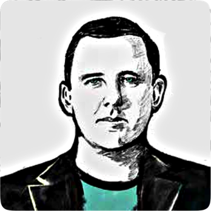
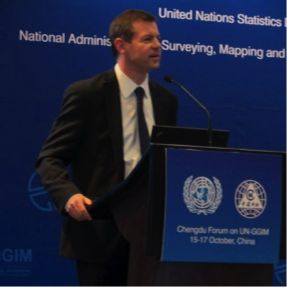
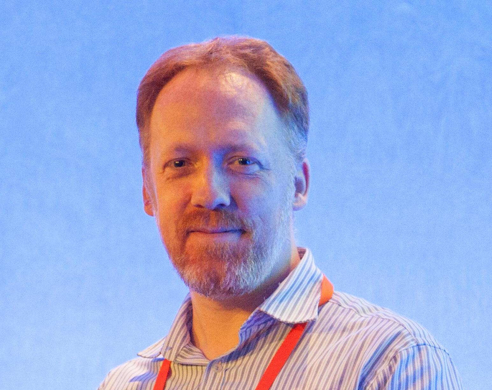

Keynote Presenters
================

We are proud to announce that the following keynote speakers will be presenting at GISRUK 2015.

- [Ed Parsons](http://www.edparsons.com/)
- [Steven Ramage](https://twitter.com/Steven_Ramage)
- [Dominic Stubbins](https://www.linkedin.com/pub/dominic-stubbins/5/439/1a2)
- [Sarah Williams](http://dusp.mit.edu/faculty/sarah-williams)

Speaker Presentations, Slides and Biographies
------------------

All keynote speakers kindly agreed to have their presentations recorded. Below you can find the videos. Note that Steven and Dominic presented in the same session, so share the same video.

### [Ed Parsons](http://www.edparsons.com/)

Geospatial Technologist for Google. (Presenting on Wednesday 15th)

<iframe align="right" width="320" height="240" frameborder="0" scrolling="auto" marginheight="0" marginwidth="0"
    src="https://mymedia.leeds.ac.uk/Mediasite/Play/cdbf9a40c030492a87e8a926af8478821d"></iframe>

Presentation available <a href="https://mymedia.leeds.ac.uk/Mediasite/Play/cdbf9a40c030492a87e8a926af8478821d">here</a>.

Ed Parsons is the Geospatial Technologist of Google, with responsibility for evangelising Google’s mission to organise the world’s information using geography. In this role he maintains links with Universities, Research and Standards Organisations that are involved in the development of Geospatial Technology. He is currently co-chair of the W3C/OGC Spatial Data on the Web Working Group. Ed was the first Chief Technology Officer in the 200-year-old history of Ordnance Survey, and was instrumental in moving the focus of the organisation from mapping to Geographical Information.  Ed earned a Masters degree in Applied Remote Sensing from Cranfield Institute of Technology and holds an Honorary Doctorate in Science from Kingston University, London. Whilst at Kingston, Ed pioneered techniques to make online resources available via the Mosaic Web browser in the early 1990s and also built his own local area network within the university for the distribution of GIS resources.

 
###[Steven Ramage](https://twitter.com/Steven_Ramage)

Director of Strategy [what3words](www.what3words.com), previously Managing Director at [Ordnance Survey International](www.ordnancesurvey.co.uk/international/) (Presenting on Thursday 16th)

<iframe align="right" width="320" height="240" frameborder="0" scrolling="auto" marginheight="0" marginwidth="0"
    src="https://mymedia.leeds.ac.uk/Mediasite/Play/37542ac868e64b68913515649634bc831d"></iframe>

Presentation available <a href="https://mymedia.leeds.ac.uk/Mediasite/Play/37542ac868e64b68913515649634bc831d">here<a/>.
 
Steven Ramage has had a very diverse career that began with container ships and marine surveying, before joining Navteq (Nokia HERE) in the 90s. In 2001 Steven joined 1Spatial (previously Laser-Scan) and led the market development of spatial database tools before being appointed as an Executive Director to the Open Geospatial Consortium and later by the Ordnance Survey to lead their international activities. Most recently, Steven became a director of what3words - an organisation that is building a global platform to simply and precisely communicate location using only words.  Steven retains contact with the Ordnance Survey as an industry consultant, and also consults for the World Bank. He is a Visiting Professor at the Institute for Future Cities at the University of Strathclyde and a fellow of the Royal Institution of Chartered Surveyors (RICS), and of the Royal Geographical Society (RGS). 
 

###[Dominic Stubbins](https://www.linkedin.com/pub/dominic-stubbins/5/439/1a2)

Chief Architect at [ESRI UK](http://www.esriuk.com/)  (Presenting on Thursday 16th)

<iframe align="right" width="320" height="240" frameborder="0" scrolling="auto" marginheight="0" marginwidth="0"
    src="https://mymedia.leeds.ac.uk/Mediasite/Play/37542ac868e64b68913515649634bc831d"></iframe>

Presentation available <a href="https://mymedia.leeds.ac.uk/Mediasite/Play/37542ac868e64b68913515649634bc831d">here</a>.
 
Dominic Stubbins is the Chief Architect at Esri UK He has extensive experience in the delivery of enterprise geospatial solutions for government, defence, utilities and the private sector. In particular, Dominic has focussed on the design of solutions, system architectures and spatial data infrastructures focussed on interoperability and data dissemination within and between organisations. Recently Dominic has been leading the development of new products centred around the analysis of ‘big’ data sets.  Above all Dominic is passionate about using geographic analysis to help understand and change the world we live in.

###[Sarah Williams](http://dusp.mit.edu/faculty/sarah-williams)

Director of the [Civic Data Design Lab](http://www.civicdatadesignlab.org/) at Massachusetts Institute of Technology’s (MIT) [School of Architecture and Planning](http://sap.mit.edu/)  (Presenting on Friday 17th)

<iframe align="right" width="320" height="240" frameborder="0" scrolling="auto" marginheight="0" marginwidth="0"
    src="https://mymedia.leeds.ac.uk/Mediasite/Play/ce91cd5b27d4481b8a49646c2fe564561d"></iframe>

Presentation available <a href="https://mymedia.leeds.ac.uk/Mediasite/Play/ce91cd5b27d4481b8a49646c2fe564561d">here</a>.
 
Sarah Williams is an Assistant Professor of Urban Planning and the Director of the Civic Data Design Lab at Massachusetts Institute of Technology’s (MIT) School of Architecture and Planning School. The Civic Data Design Lab works with data, maps, and mobile technologies to develop interactive design and communication strategies that bring urban policy issues to broader audiences.  Trained as a Geographer (Clark University), Landscape Architect (University of Pennsylvania), and Urban Planner (MIT), Williams’ work combines geographic analysis and design. Sarah’s design work has been widely exhibited including work in the Guggenheim and the Museum of Modern Art (MoMA) in New York City. 
Before coming to MIT, she was Co-Director of the Spatial Information Design Lab at Columbia University’s, Graduate School of Architecture Planning and Preservation(GSAPP). Williams has won numerous awards including being named top 25 planners in the technology and 2012 Game Changer by Metropolis Magazine. Her work is currently on view in the Museum of Modern Art (MoMA), New York.
