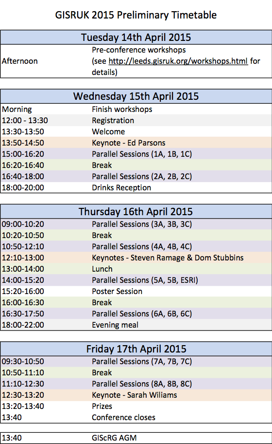
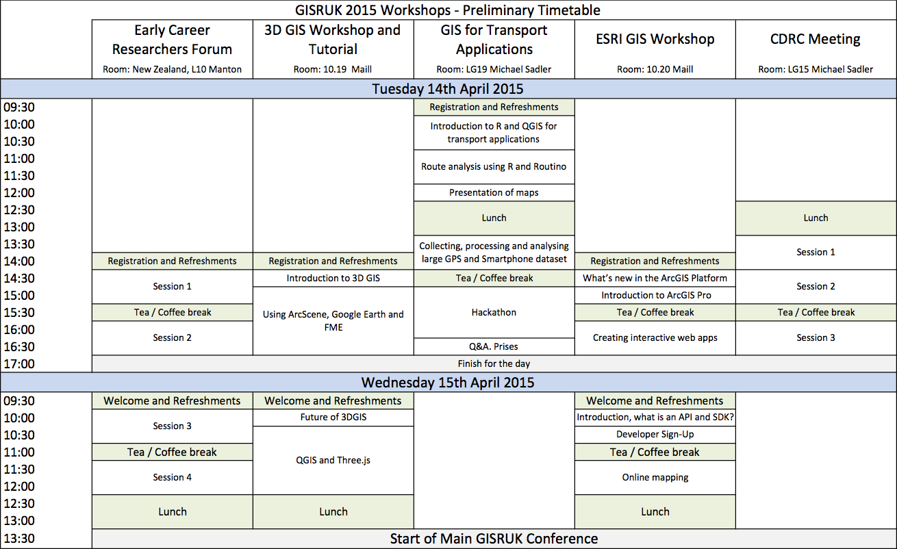

 - Download the **[full conference handbook (.pdf)](./programme_files/GISRUK_handbook.pdf).**
 - Download **[all paper abstracts (.zip)](XX)** 
 

 
GISRUK Conference Programme
---------------

This page contains the draft conference programme. To find out when your paper has been scheduled simply locate your paper on the searchable list of [papers and their timetabled sessions](#sesions).

You can also find:

 - An [overview](#programme) of the programme.
 
 - A [workshop programme](#workshop), containing an overview of all the workshops.
 
 - A <a href="./session_overview.html">session overview</a> that lists all papers and abstracts by their session.

Preparing your Presentation or Poster
---------------

If you are presenting a paper, please prepare a presentation that is **no longer than 15 minutes**. This
will allow a few minutes for questions. If you have electronic slides, these can be uploaded on the
day. The presentation computers will have internet access (barring any unexpected failures).

If you are preparing a poster, it will need to fit on a poster board that is A0 size portrait. So
your poster can either be A0 portrait size, or A1 landscape (or smaller of course).

<a name="sessions">Papers and their Timetabled Sessions</a>
---------------

This is a searchable table. Put text into the boxes below and only papers that match your search criteria will be shown. Clear the text boxes to show all papers.

To find out when your session has been timetabled, see the main [conference programme](#programme).

<!--
NOTE: the searchable programme below comes from the 'programme' branch of this project. See that branch for details about how it works, where the data come from, and how it was created
ALSO NOTE: after copying in the 

<a name="programme">Conference Programme</a>
---------------

<!---
The preliminary programme is as follows:

<iframe src="programme-draft.html" width="95%" height="600px"></iframe> 
-->

<a name="workshop">Workshop Timetable</a>
---------------

